# BURHAN

> **Agents should not merely say they finished. They should prove it.**

BURHAN is an independent verification plane that turns a bounded coding task into sealed, reproducible evidence before it accepts or rejects an agent's work.

## The problem

An agent's “done” message, test summary, or structured completion claim is not independently trustworthy. A coding task needs explicit requirements, protected boundaries, and verification that the agent cannot author.

## What BURHAN does

1. Compiles and human-seals a bounded `ProofContract`.
2. Qualifies a deterministic validator pack against positive and negative controls.
3. Captures candidate state, verifies it in a fresh workspace, and issues the verdict from BURHAN-owned evidence.
4. Preserves local artifact integrity with canonical hashes and linked receipts.

## Demo story

The payment-idempotency demo requires exactly one charge from twenty concurrent same-key requests, keeps distinct keys independent, documents the API header, and protects migrations, tests, and dependency manifests.

- A real **live Codex Validator Architect** proposed a strategy that BURHAN validated and qualified.
- A separate real **live Codex Executor** ran. BURHAN captured its empty candidate patch and independently issued **REJECTED** in a fresh workspace.
- The original live run cannot support same-thread repair because its complete retained bundle did not yet exist. BURHAN reports `REPAIR_CONTEXT_UNAVAILABLE`.
- The UI repair sequence is a clearly labeled **DETERMINISTIC REPAIR DEMO**. It uses the same sealed validator standard, `SamePackProof`, fresh verification, linked local-artifact-integrity receipts, and tampering detection to produce deterministic **VERIFIED** evidence.

## Architecture

```mermaid
flowchart LR
  U[User task] --> CC[Contract compiler]
  CC --> HS[Human seal]
  HS --> VB[Untrusted ValidatorBlueprint]
  VB --> DC[Deterministic compiler]
  DC --> QG[Qualification gate]
  QG --> VP[Sealed validator pack]
  VP --> EX[Separate Executor]
  EX --> PC[Parent-owned patch capture]
  PC --> FV[Fresh verification]
  FV --> V[BURHAN verdict]
  V --> CE[Sanitized counterexample]
  CE --> HA[Human approval]
  HA --> DR[Deterministic repair demo]
  DR --> LR[Linked receipts]
```



See [docs/architecture.md](docs/architecture.md) and [docs/threat-model.md](docs/threat-model.md).

## Trust boundaries

- **Untrusted:** model drafts, ValidatorBlueprints, Codex output, `AgentExecutionClaim`, and candidate patch.
- **Deterministic BURHAN components:** filtering, linting, trusted templates, qualification, sealing, patch capture, fresh verification, and verdict reduction.
- **Protected artifacts:** sealed contracts, validator packs, qualification reports, evidence, and receipt-chain hashes.
- **Execution:** `local_trusted` is local independent execution assurance—not a secure sandbox, complete network isolation, malicious-code containment, or a mathematical correctness guarantee.

## Live versus deterministic disclosure

| Label | Truthful meaning |
| --- | --- |
| **LIVE CODEX RUN** | Historical evidence from real Codex Architect and Executor runs. |
| **LIVE BURHAN VERIFICATION** | BURHAN captured the candidate state and returned `REJECTED`. |
| **DETERMINISTIC REPAIR DEMO** | A reproducible local proof demonstration, not a second live Codex repair. |
| **local artifact integrity** | Local Ed25519 integrity only; not external attestation or certification. |

## How GPT-5.6 was used

SpecForge includes server-side GPT-5.6 Structured Outputs integration for an untrusted contract draft, followed by deterministic linting and human approval. Deterministic compiler fixtures pass. This submission does **not** claim successful live GPT-5.6 Platform API inference: the final live compiler evaluation was not completed because API quota was unavailable.

## How Codex was used

Codex was used for the real historical Validator Architect and Executor runs. Its strategy and completion claim never determined the verdict. BURHAN's qualified pack, captured patch, and fresh verification determined the live `REJECTED` result.

## Quick start

Requirements: Node.js 20+ and npm. The primary workflow is Windows-native; Docker, WSL, and containers are not required.

```powershell
npm ci
npm run dev
```

Open `http://localhost:3000`.

## Demo commands

```powershell
npm run dev
```

Follow [docs/demo-script.md](docs/demo-script.md). **Reset Demo** removes only temporary demo artifacts and returns the interface to the original `REJECTED` state.

## Validation commands

```powershell
npm test
npm run typecheck
npm run build
npm run eval:burhan
npm run eval:compiler:fixtures
npm run eval:codex:fixtures
npm run eval:validator-qualification
npm run eval:executor:fixtures
npm run eval:execution-verification
npm run eval:architect-output
npm run eval:counterexample:fixtures
npm run eval:repair-loop
npm run eval:repair-orchestration
npm run eval:submission-demo
git diff --check
```

## Evaluation results

```text
Valid candidate accepted                 1 / 1
Invalid candidates rejected              4 / 4
False accepts                            0
Compiler fixtures                        12 / 12
Executor fixtures                        16 / 16
Positive / negative controls             2 / 2, 4 / 4
Qualification                            QUALIFIED
Original live verdict                    REJECTED
Deterministic repair verdict             VERIFIED
SamePackProof                            PASS
Original / repair receipt                VERIFIED / VERIFIED
Receipt chain / tampering                VERIFIED / PASS
Demo reset                               PASS
Provider attempts in submission checks   0
```

## Repository structure

```text
apps/web                       Submission demo UI
packages/core                  Contracts, evidence, receipts, state machine
packages/specforge             Fact Pack and contract compiler boundary
packages/validator-compiler    Trusted templates and pack sealing
packages/validator-qualification Qualification controls
packages/codex-runner          Codex lifecycle, repair loop, safe reset
packages/verifier              Fresh verification and linked receipts
packages/workspace             Workspace and path-safety utilities
examples/payment-service       Payment-idempotency fixture
docs                           Submission materials and trust documentation
```

## Known limitations

- `local_trusted` does not protect against a compromised host, administrator-level attacker, malware, or unrestricted network behavior.
- The original live run reports `REPAIR_CONTEXT_UNAVAILABLE` for same-thread repair.
- GPT-5.6 live Platform API inference is not completed evidence because quota was unavailable.
- BURHAN is not a formal proof system for arbitrary programs.

## Security and secret handling

Fact Packs exclude secrets, Git metadata, binaries, build output, and protected paths. Codex credentials remain local to the CLI and are not copied into the browser or BURHAN artifacts. Submission materials must not contain credentials, hidden validator source, protected paths, raw provider streams, or private reasoning.

## Hackathon submission notes

- [Devpost copy](docs/devpost.md)
- [Video package](docs/demo-script.md)
- [Screenshot package](docs/screenshots.md)
- [Final checklist](docs/submission-checklist.md)
- [Codex and GPT-5.6 disclosure](docs/codex-contributions.md)

Create the final `submission-v1` tag only after human upload review.
