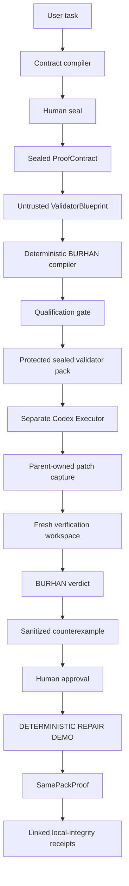

# BURHAN architecture summary

BURHAN separates agent proposals from verifier-owned evidence. It issues a verdict only after deterministic checks in a fresh workspace. Its execution assurance is `local_trusted`, not a secure sandbox or hostile-code-containment claim.

## Trust labels

| Area | Label | Meaning |
| --- | --- | --- |
| Model draft and ValidatorBlueprint | Untrusted model output | Schema-checked and linted; cannot issue a verdict or add arbitrary validator source. |
| Contract, qualification, fresh verification | Deterministic BURHAN components | BURHAN owns templates, controls, evidence, protected-path checks, and verdict reduction. |
| Contract, pack, evidence, receipt chain | Protected artifacts | Hashes and seals bind the evidence used for a verdict. |
| Execution | `local_trusted` | Local independent execution with documented limits; not a containment guarantee. |

## Live evidence and deterministic repair

The live Codex Architect and Executor flow is historical evidence. BURHAN qualified the strategy, captured the Executor candidate, and returned `REJECTED` after fresh verification because the candidate patch was empty.

The original live run lacks the complete retained bundle required for a same-thread repair and accurately reports `REPAIR_CONTEXT_UNAVAILABLE`. The UI repair sequence is a **DETERMINISTIC REPAIR DEMO**, not a live retry. It reuses the sealed validator standard, produces `SamePackProof`, completes fresh verification, and links the rejected and verified attempts with local artifact-integrity receipts.

## Security boundaries and limits

- Secret-excluding Fact Packs prevent repository credentials and protected paths from entering model context.
- Agent output, `AgentExecutionClaim`, and candidate code are untrusted.
- Fresh verification owns the verdict; an agent cannot self-certify completion.
- Local Ed25519 signatures indicate local artifact integrity only. They are not external attestation or formal certification.
- `local_trusted` does not claim protection from a compromised host, malicious code, administrator access, or unrestricted network behavior. See [threat-model.md](threat-model.md).
